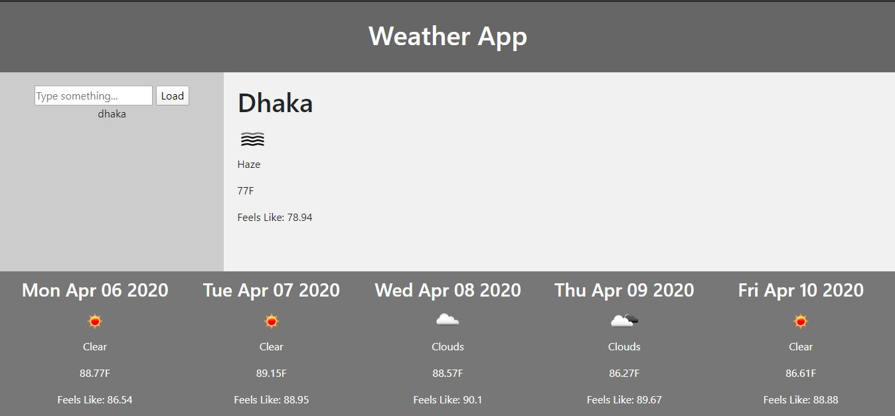

## homework5
## Work Day Schedule

I Created a simple calendar application that allows the user to save events for each hour of the day. This app will run in the browser and feature dynamically updated HTML and CSS powered by jQuery.
I used the [Moment.js](https://momentjs.com/) library to work with date and time by using Moment.js in the browser.

## Acceptance Criteria

AS AN employee with a busy schedule
I WANT to add important events to a daily planner
SO THAT I can manage my time effectively.

GIVEN I am using a daily planner to create a schedule
WHEN I open the planner
THEN the current day is displayed at the top of the calendar
WHEN I scroll down
THEN I am presented with timeblocks for standard business hours
WHEN I view the timeblocks for that day
THEN each timeblock is color coded to indicate whether it is in the past, present, or future
WHEN I click into a timeblock
THEN I can enter an event
WHEN I click the save button for that timeblock
THEN the text for that event is saved in local storage
WHEN I refresh the page
THEN the saved events persist

## Build status
project still in development phase

Build status of continus integratio
tools: (to be used):
    1. jenkins
    2. heroku
    

## Code style

## Tech/framework used
    node.js

## Features

    1. user friendly
    2. simplified 
    3. Easy Navigation
    4. SEO (Search Engine Optimization)
    5. Mobile Friendly

## Code Example

    1. Used consistent indentation
    2. Followed the DRY Principle
    3. Avoided Deep Nesting
    4. kept Limited line length
    5. standard File and folder structure
    6. standard Naming conventions.
    7. Kept the code simple.

## Installation

## Screenshot

## API Reference

https://openweathermap.org/

## Tests
project still in development phase

## Contribute

Let people know how they can contribute into your project. A [contributing guideline](https://github.com/zulip/zulip-electron/blob/master/CONTRIBUTING.md) will be a big plus.

## Credits
upenn coding bootcamp

## License
A short snippet describing the license (MIT, Apache etc)

MIT © [Amith Das]()
